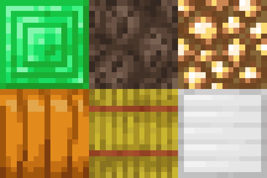
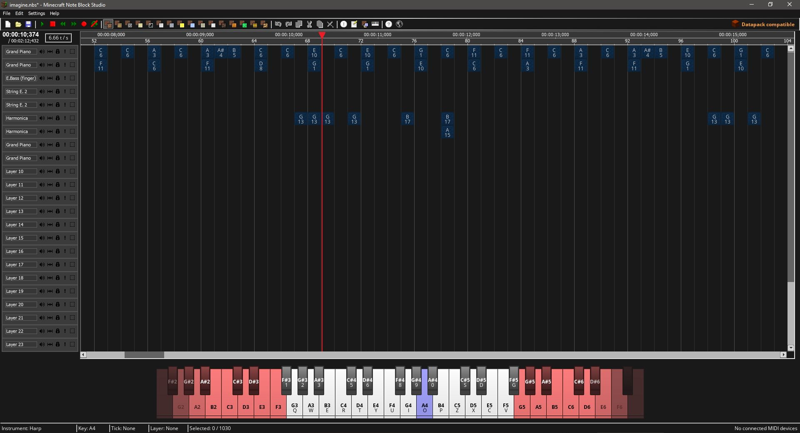

<body class="landing">
	<!-- Banner -->
	<section id="banner">
		<h2>Features</h2>
		
What makes us different from the original Note Block Studio

	</section>
	<section id="one" class="wrapper style2 special">
		

			

				

					

						
						

							<h2>Datapack export</h2>
							
								
Note block music in Minecraft, without any actual note blocks. It really is magic.
									  
									With datapack export, you can export your song to a datapack. After you've exported your song, move the created datapack inside the "datapacks" directory of your world folder, and that's all there is to it!  Now just join your world, and you can:

									<ul>
										<li><strong>Play</strong> your song by running:  <code>/function &lt;datapack_name&gt;:play</code></li>
										<li><strong>Pause</strong> your song by running:  <code>/function &lt;datapack_name&gt;:pause</code></li>
										<li><strong>Stop</strong> your song by running:  <code>/function &lt;datapack_name&gt;:stop</code></li>
									</ul>
									

									Of course you need to have cheats enabled to run these commands.
									 
									When exporting, there's also an option that allows nearby players to hear the music too. This way you can be a walking music player!
									 
								Datapacks also support more tempo's than note blocks, so you may just find the perfect tempo when exporting as a datapack.

							
						

					

				

				

					

						
						

							<h2>1.14 Note Block Support</h2>
							
OpenNBS supports all 6 new note block sounds added in Minecraft 1.14!

						
			
					

				

				

					

						
						

							<h2>Dark theme</h2>
							
When using Note Block Studio late at night, you might have wondered: why are my eyes burning?
							Well wonder no more! With dark theme you can compose all night long!

						

					

				

				

					

						
						

							<h2>Stereo Sound</h2>
							
When exporting as MP3 or datapack, the note block sounds are able to pan to the left or right, which allows stereo sound. With this you can create exceptionally immersive songs!

						

					

				

			

		

	</section>
</body>
<!-- Discord -->
<section id="two" class="wrapper style3 special">
	

		<header class="major">
			<h2>Keep in touch</h2>
			
By joining our Discord server!

		</header>
		<ul class="actions">
			<li><a href="https://discord.gg/w35BqQp" class="button special big">Join</a></li>
		</ul>
	

</section>