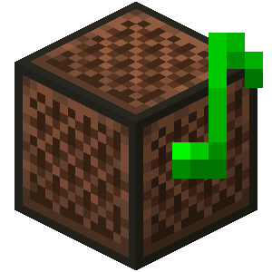

<body class="landing">
	<!-- Banner -->
	<section id="banner">
		
		<h2>Open Note Block Studio</h2>
		
An open source note block song editor

		<ul class="actions vertical">
			<li><a href="https://github.com/HielkeMinecraft/OpenNoteBlockStudio/releases/latest/download/Minecraft.Note.Block.Studio.exe" class="button special icon fa-download big" id="downloadBtn">Get latest version</a></li>
			<li><a href="{{'/changelog' | absolute_url}}" class="button">View changelog</a></li>
		</ul>
	</section>
	<!-- One -->
	<section id="one" class="wrapper style2 special">
		

			

				

					<i class="fa fa-bug" style="font-size:40px"></i>
					<h2>Reporting bugs</h2>
					
When experiencing bugs, please report them at the issues page.
						This is also the place to give feedback!
						<strong>Note:</strong> please search before creating a new issue!
						  
						<a href="https://github.com/HielkeMinecraft/OpenNoteBlockStudio/issues" class="button">Report an issue</a> 	
					

				

				

					<i class="fa fa-comments" style="font-size:40px"></i>
					<h2>Keep in touch</h2>
					
Keep in touch with us by joining our public Discord server. This is also the fastest way to contact us!  
						 <a href="https://discord.gg/w35BqQp" class="button">Join Server</a>
					

				

				

					<i class="fa fa-users" style="font-size:40px"></i>
					<h2>Contributions</h2>
					
This project is written in Game Maker Language (GML).
						 
						You must have GameMaker Studio 2 in order to open this project and make changes.  
						<a href="https://github.com/HielkeMinecraft/OpenNoteBlockStudio/pulls" class="button">Contribute!</a> 
					

				

			

		

	</section>
	
</body>